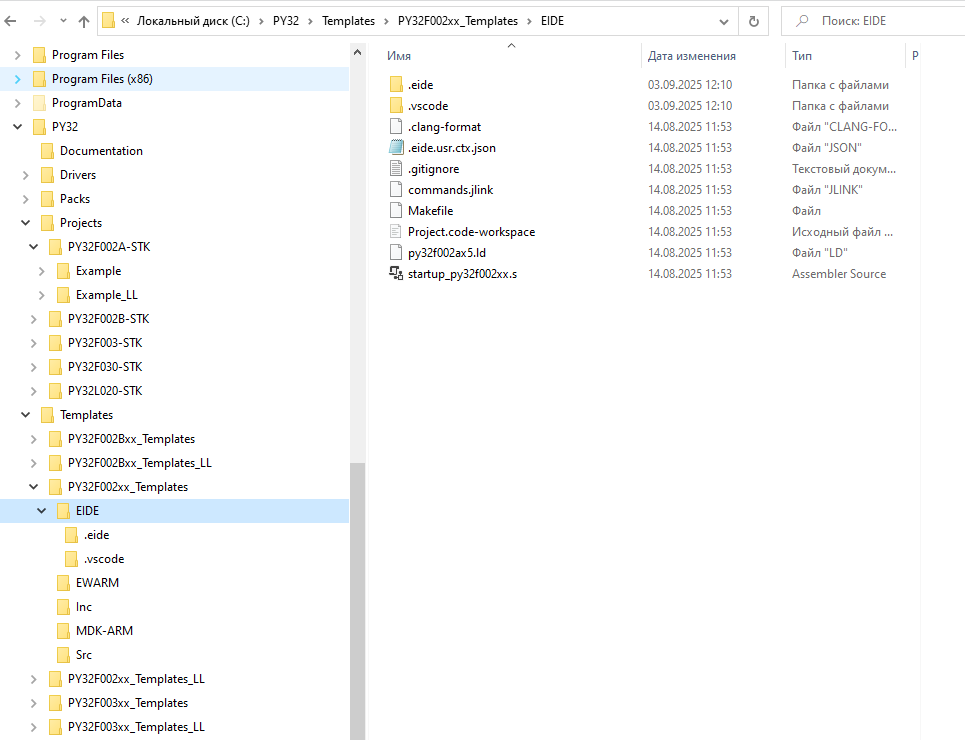

### Установка и настройка  VSCode + EIDE + pyocd + openocd

Все эти программы можно установить по отдельности, но PUYA сделала пакет PY32_GCC_SDE который устанавливет всё это и ещё дополнительные утилиты.

[Ссылка для скачивания](https://www.puyasemi.com/download_path/%E5%B7%A5%E5%85%B7/MCU%20%E5%BE%AE%E5%A4%84%E7%90%86%E5%99%A8/PY32_GCC_SDE_V1.0.0.zip) 

после установки архивы проектов в папке - C:\Program Files (x86)\PuyaSDE\sdk\example

но лучше скачать свежие архивы Firmware на сайте PUYA --> [Firmware F0xx](https://www.puyasemi.com/download_path/%E5%BA%93%E5%87%BD%E6%95%B0%E4%B8%8E%E4%BE%8B%E7%A8%8B/MCU%20%E5%BE%AE%E5%A4%84%E7%90%86%E5%99%A8/PY32F0xx_Firmware_V1.4.9.zip) 

в версии 1.4.9 - основным отладчиком в проектах EIDE - сделан pyocd

основные примеры для библиотеки HAL, но есть и для библиотеки LL

шаблоны в папке  ./Templates 
примеры в папке  ./Projects  - для демоплат 

В данном случае я распаковал архивы Firmware для F0xx и F002B в одну папку  C:\PY32 

Далее - если всё встало нормально 
запускаем VSCode с нужной папкой примера или шаблона 
сборка, прошивка и отладка должны быть без проблем

! pyocd - желательно один программатор чтобы был подключен 
(работает с ST-Link V2; J-Link OB V2; CMSIS-DAP(любой ?) )

