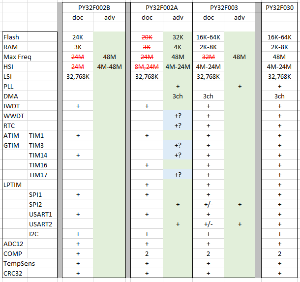

##  Обзор и тестирование семейства контроллеров PY32F002A,F003,F030

### Введение
Данные чипы построены на одном кристалле и имеют все свойства старшей модели PY32F030.<br>
Ограничение есть только на возможности назначения функций на существующие порты в корпусе.<br> 
(в PY32F030 есть управление LED сегментными индикаторами и возможно только в корпусах 32pin)<br>
$\textsf{\color{red}! не путать с PY32F002B это другие чипы --> }$ [PY32F002B](https://github.com/Xiamatsu/py32f002b) 

Внутренняя периферия
```
Flash/RAM:  16K/2K; 32K/4K; 64K/8K    (для F002A - 32K/4K)
Max Frequency: 48MHz
  HSI - 4; 8; 16; 22.12; 24 MHz  (есть калибровочные константы)
  HSE - 4-32 MHz
  PLL - x2 (from HSI or HSE)  (PLL_in = 16-24 MHz)
  LSI - 32.768kHz  (есть калибровочная константа)
  LSE - 0-1000kHz  (F030: lqfp32, qfn32, tssop20 (1,3,4), qfn20 (1) )
                   (F003: tssop20 (4), qfn20(2) ) 
DMA - 3ch, IWDG, WWDG, SysTick, RTC
Timers (16bit): Adv:1, GP:4, LP:1, 
2x USART, 2х SPI, 1x I2C
ADC 12bit (10+2ch) (1Msps), 2x Comp
TempSens (с калибровочными константами)
Vref = 1.2V (с калибровочной константой)
Hardware CRC-32 module
Support 4-digit 8-segment common-cathode LED digital tube (F030) (Icom 20;40;60;80mA)
ISP - bootloader USART ( PA2,3  PA9,10  PA14,15 ) (BOOT0='1')
1.7 - 5.5 V
```

$\textsf{\color{green}Дополнительные сведения по заводским константам в ПЗУ --> }$
[Factory Config](./bootloader/README.md)

$\textsf{\color{red}!!!   ВСЕ ПРОЕКТЫ можно делать с шаблоном PY32F030x6 или PY32F030x8}$<br> 
( для F002A - используем шаблон PY32F030x6 )<br>
// и это охватывает почти все варианты, учитывая что 16K/2K очень мало чипов

### Особенности
```
---  Медленная ОЗУ - команды чтения/записи  (LDR/STR)  выполняются по 2-4 такта  "МИНУС !!!"
       (зависимость по скорости - не определена)
       (доступ к портам  - чтение/запись  (LDR/STR) - только по 1 такту)
       более подробно по тактам работы процессора - см. ниже тесты.
---  Параметр HSI_DIV присутствует в настройках RCC и работает
       (положение в регистрах подобно PY32F002B - где он официально присутствует )
       (в разных версиях документации на схеме тактирования иногда присутствует)
---  Некорректное описание POR/PDR на картинке (Figure 5-2 RM) 
       нельзя установить разные очень уровни VBOR8 и VBOR1 одновременно
       это возможно при изменении в программе параметра VBOR - option byte
---  Flash Sleep Mode в режиме LP Run (HCLK = 32,768кГц) - устанавливается, 
       но выходить из этого режима не получается
       на другой серии PY32F002B - удалось найти решение выхода    
       потребление - LP Run + Flash Sleep - 100-120 мкА (LP Run - 170-190 мкА))   
---  Программирование по 3-м проводам ( pyocd + CMSIS-DAP )
       SWDIO,SWCLK,GND без питания, 
       но должен быть конденсатор на VCC-GND 0.1uF
       режим сразу со сбросом и прошивкой (стиранием)       
``` 

### Документация и программы

Информация есть на сайте компании PUYA (только лучше смотреть китайский вариант)<br>
Обновляется довольно часто

Также стараюсь актуальные версии выкладывать в облако
[DOCS - PY32](https://disk.yandex.ru/d/82thvfnrF28y9Q)

### Ревизии

На данный момент есть две ревизии - 'B' и 'E'<br>
номер на чипе в последней строке, последняя буква  'B' или 'E'<br>
на демоплате embedfire как раз стоит PY32F030EK28U6<br>
что даже отражено в наименовании<br>
  


Единственное отличие отличие по DS:<br>
PLL_IN - только 24 MHz<br>
В ревизии 'B':  16 - 24 MHz

### Корпуса
```
lqfp32        - F030 ( 1,2 pinouts )
qfn32(5x5)    - F030 ( 2,3 pinouts )
qfn32(4x4)    - F030 ( 4 pinout )
qfn24(3x3)    - F030 ( 1 pinout )
ssop24        - F030 ( 1,2 pinouts )
qfn20(3x3)    - F030 ( 1,2,3 pinouts ); F003 ( 1,2 pinouts ); F002A ( 1 pinout )   
tssop20       - F030 ( 1,2,3,4 pinouts ); F003 ( 1,2,3,4,5,6 pinouts ); F002A ( 1 pinout )      
sop20         - F003 ( 1 pinout )    
qfn16(3x3)    - F002A ( 1 pinout )  
sop16         - F003 ( 1 pinout ); F002A ( 1 pinout )      
msop10        - F003 ( 1 pinout ); F002A ( 1 pinout )    
essop10       - F002A ( 1 pinout )  
sop8          - F003 ( 1,2 pinouts ); F002A  ( 1 pinout )   
dfn8(3x2)     - F003 ( 1 pinout )  
dfn8(1.5x1.5) - F030 ( 1 pinout )  

lqfp32      e=0.8
qfn32(5x5)  e=0.5;  qfn32(4x4)  e=0.4
ssop24      e=0.635
qfn16(3x3)  e=0.5;  qfn20(3x3)  e=0.4;  qfn24(3x3) e=0.35  
tssop20     e=0.65
msop10      e=0.5;  essop10  e=1.0
dfn8(3x2)   e=0.5;  dfn8(1.5x1.5)  e=0.4
sop8,16,20  e=1,27
```
// разводка выводов (pinout) <br>
// определяется цифрой после буквы количества выводов<br>
//  $\textsf{PY32F030K\color{red}2\color{black}8T6}$ - 2-ой pinout<br>
//   в основном все разводки разные<br>
//   совпадают  PY32F030F2xPx = PY32F003F1xPx - tssop20<br>
//   совпадают  PY32F030F2xUx = PY32F003F1xUx - qfn20<br>
//   совпадают  PY32F030F1xUx = PY32F003F2xUx - qfn20<br>
$\textsf{\color{red}ВНИМАНИЕ!}$<br>
$\textsf{\color{orange}для большинства корпусов dfn, qfn:  exposed pad - является единственным контактом Vss !}$  


### Демоплаты

$\textsf{\color{blue}1. EmbedFire PY32F030K28U6TR  ( стоит чип PY32F030EK28U6 rev.E )}$
```
   LED1      - Power
   LED2,3,4  - PA2,3,4
   Key RST   - Reset (PF4)
   KEY1,2    - PA5,6
   HSE       - 24 MHz (PF0,1)
   LSE       - opt (PA9,10)
   I/O       - 26 (PA0-8,PA11-15,PB0-8,PF2-4) 
```


Схемы и описания демоплат в папке - DemoBoard


### Ремапинг 

Очень богатый выбор ремапинга функций портов (альтернативные функции)<br>
Индивидуально можно настроить каждый пин.<br>
Шаблон возможных вариантов [REMAP](./ReMapIO/remap_pin_py32f0xx.xlsx) <br>

Учитывая одинаковый кристалл внутри данного семейства имеем всего 30 i/o<br>
и все возможные варианты альтернативных функций от F030<br>
Как пример: приведен расклад<br>  
2x full SPI + 2x USART + 3 i/o - для PY32F002AW15U6 (qfn16 3x3)<br>

Отдельная страница
[Схемы распиновки](./QuickReference/QR.md)

или<br>
<details><summary><i> PY32F002AL15S6  sop-8 </i></summary>
  
</details>


### Программаторы (Windows 10)

$\textsf{\color{blue}1. ST-Link V2}$
```
Keil  - работает без проблем
pyocd - в основном работает (кроме режима стирания при Reset или подаче питания) 
```

$\textsf{\color{blue}2. J-Link OB (клон из BluePill STM32F103)}$
```
Keil   - работает, только требуется добавить описание контроллеров
         в папку <USER>\AppData\Roaming\SEGGER\JLinkDevices\ 
         скопировать содержимое папки JLinkDevices
         ( для большинства контроллеров PUYA )
pyocd  - совсем не работает и при любой команде убивается клон J-Link 
JFlash - не работает 
Py32CubeProgrammer - работает
```


$\textsf{\color{blue}3. J-Link OB v2 (клон с али на STM32F072)}$
```
Keil   - работает, также требуется добавить описание контроллеров
pyocd  - работает (кроме режима стирания при Reset или подаче питания) 
JFlash - работает 
Py32CubeProgrammer - работает
```

$\textsf{\color{blue}4. CMSIS-DAP}$<br>
(проверено с  WCH-LinkE, SLogic Combo, DAP-Link(f072) )
```
Keil  - работает, только есть ошибка при стирании чипа, 
        но чип стирается, а заливка не проходит
        если разделить стирание - отдельно, 
        заливка (без стирания) - отдельно
        то всё нормально! 
pyocd - прошивка, стирание - работает и даже при подаче питания стирать можно        
        (работает режим по 3-м проводам, см. ниже)
edbg  - прошивка, стирание, а также работа с option bytes
        (удобная для lock/unlock)          
openocd - пробовал подключать с WCH-LinkE (чип читал пока только)
          openocd - редакция от Puya !
```
$\textsf{\color{red}ВНИМАНИЕ!}$<br>
$\textsf{\color{orange}WCH-LinkE в режиме DAP - горят два светодиода красный и синий !}$  


$\textsf{\color{blue}5. UART (ISP)}$
```
Проверено только в Py32CubeProgrammer
пары выводов для UART (PA2,3; PA9,10; PA14,15)
обязательно Boot0='1' (только tssop20,qfn32,lqfp32)
на PY32F030K28T6 - только получилось на PA14,15
на PY32F030EK28U6 (демоплата) - PA2,PA3 и PA14,15 - работает 
(PA9,10 - тоже работает - через контакты 32k LSE кварца - который не установлен) 
```

### Утилиты 

$\textsf{\color{blue}1. Py32CubeProgrammer}$
```
работает с J-Link и через UART (ISP BOOT0='1')

внимательно работаем - лучше все действия делать при disconect-е
при прошивке он сам сделает connect  и  disconnect

все операции проходят фактически при  disconnect !!!
странно очень
```

$\textsf{\color{blue}2. pyocd}$
```
для работы с pyocd нужны файл конфигурации и пакет DFP

- загрузка и установка пакета
pyocd pack install PY32

- загрузка и обновление пакета
pyocd pack install -u PY32

- пример команды стирания
pyocd erase --target PY32F030x6 --chip

- пример команды прошивки (также стирает)
pyocd flash --target PY32F030x6 blink.hex 

!!! не работает с заблокированным чипом (RDP Level 1)
```

$\textsf{\color{blue}3. edbg}$

исправленная и дополненная версия
[edbg](https://github.com/Xiamatsu/edbg)
скомпилированный вариант для Windows
[edbg.exe](https://disk.yandex.ru/d/82thvfnrF28y9Q/Soft/edbg.exe)
```
работает только с CMSIS-DAP 
( WCH-LinkE; SLogic Combo; DAP-Link(f072) )
настроена на работу с PY32F002A+, PY32F002B
// исправлено от оригинальной версии
// - с PY32F002B  - не работало совсем, добавлен другой target - py32f002b
// - с PY32F002A+ - настроено на работу со всеми чипами и с определением чипа
//                  из Factory Config и размера флеша
//                  изменился target - py32f0xx

принимает только бинарные файлы *.bin
есть возможность работать с Option Bytes (lock, unlock) и по отдельности
Нормально проходит lock (RDP Level 1) и unlock (RDP Level 0)
  только после данных команд надо отключать питание !

ПРИМЕРЫ:
 прошивка
   edbg -b -t py32f0xx -p -f <filename.bin>

 прошивка на частоте 1МГц (по умолчанию 16МГц)
   edbg -b -t py32f0xx -c 1000 -p -f <filename.bin>

 чтение
   edbg -b -t py32f0xx -r -f <filename.bin>

 стирание 
   edbg -b -t py32f0xx -e

 стирание на частоте 1МГц со сбросом 10мс
   edbg -b -t py32f0xx -e -c 1000 -x 10

 прошивка с блокировкой
   edbg -b -t py32f0xx -p -k -f <filename.bin>

 блокировка
   edbg -b -t py32f0xx -k

 разблокировка
   edbg -b -t py32f0xx -u

 чтение option bytes (все 4 байта)
   edbg -b -t py32f0xx -F r0,:,

 переключение NRST в режим GPIO
   edbg -b -t py32f0xx -F w0,14,1

 переключение NRST обратно в режим NRST
   edbg -b -t py32f0xx -F w0,14,0
```

$\textsf{\color{blue}4. openocd}$
```
 - в процессе изучения 
```

### IDE

$\textsf{\color{blue}1. Keil}$<br>
    нормально можно работать, учитывая отладчик встроенный<br>
    и поддерживающий разные варианты подключаемых программаторов<br>
    (минус - библиотека DFP 1.2.8 с ошибкой при создании нового проекта<br>
    для F030 добавляется два комплекта стартап файлов для F030 и F031)<br>
    P.S. ( исправлено  в DFP 1.2.9 - см. папка SDK )

$\textsf{\color{blue}2. Eclipse}$<br>
    при создании проекта статртап файлы не добавляются (может чего не донастроено)<br>
    при настройке вручную - всё работает.

$\textsf{\color{blue}3. IAR -}$<br>
    В процессе изучения

$\textsf{\color{blue}4. VSCode + EIDE + pyocd/jlink -}$<br>
    Сборка примеров переделанных по другому - [eide](https://github.com/Xiamatsu/PY32F_eide)

$\textsf{\color{blue}5. VSCode + PlatformIO -}$<br>
    В процессе изучения


### Интересные тесты

#### Проверка что это один и тот-же кристалл

В отладчике и программаторах реально читается 32K Flash и 4K RAM для PY32F002A<br>
Проверено - что PLL запускается на 48MHz на чипах PY32F002A и PY32F003<br>
Проверено - DMA присутствует и работает на чипах PY32F002A<br>
Проверено - SPI2 и USART2 присутствует на чипах PY32F002A<br> 
            и есть только ограничение ремапинга по использованию<br> 
            в корпусах с малым количеством выводов

Таблица сравнения периферии (синим - ещё не проверено)<br>


#### Прошивка с ошибкой - как тест сброса контроллера

Случайно сделал прошивку с ошибкой<br>
== Назначение PLL как SYSCLK, когда PLL не запущен<br>
В данном режиме программаторы не видят чип (или видят но не могут ничего сделать)<br>
При использовании данной прошивки как тестовой - получилось

(pyocd)<br>
= стирание памяти при Reset, но кроме чипа PY32F030EK28U6 (на демоплате embedfire).<br>
  (проверено на PY32F002AL15S6, PY32F003L24D6, PY32F002AW15U6, PY32F030K28T6, PY32F030EK28U6)<br>
= данный чип (PY32F030EK28U6) удалось стереть только при подаче питания

(Py32CubeProgrammer)<br>
= подключение по UART при Boot0-"1" - чип можно перепрограммировать (ISP)

(edbg)<br>
= всё стирает, не нужен Reset (требуется доп. проверка !)

#### Стирание прошивки (сброс) при использовании служебных выводов (SWC,SWD,NRST)

Исходя из прошивки с ошибкой - проведён тест по использованию "всех" портов<br>
на порты с служебными функциями назначены были вывод меандра (LED blink)<br>
SWC,SWD,NRST (предварительно NRST переведён в режим GPIO)

После прошивки данный чип недоступен для подключения программаторами<br>
Проведён тест с помощью pyocd стереть чип при подаче питания<br>
== Успешно == (только CMSIS-DAP) //  с настоящим J-Link - тоже должно работать

Если есть вывод Boot0 и он используется как вход, то<br>
Py32CubeProgrammer - подключение по UART при Boot0-"1" - чип можно перепрограммировать

$\textsf{\color{red}ОБЯЗАТЕЛЬНА ЗАДЕРЖКА - SWD-Delay !}$<br>
( для PY32F002A;F003;F030 - в стартап файлах нет этого - смотрим как сделано в PY32F002B )<br>
( проверено с задержкой 100мс )

#### Программирование по 3-м проводам

И есть возможность программировать по 3-м проводам<br>
SWD; SWC; GND + обязательно конденсатор VCC-GND<br>
питание наводится от SWC и его достаточно для стирания и программирования<br>
( если схема позволяет - нет большой нагрузки )<br>
в данном случае и автоматически подаётся питание (сброс по питанию) !<br>
// проверено на демо плате и на другой макетке с F030<br>
// pyocd + CMSIS-DAP

####  HSI  -  более подробно
```

1. HSI_TRIM - разбита на 2 части
              TRIM_H  - биты  12-9
              TRIM_L  - биты  8-0

   TRIM_L - задает смещение относительно минимальной -  0x000 - 0x1FF  
            min   - TRIM_L = 0x000   TRIM_H = 0
            max1  - TRIM_L = 0x1FF   TRIM_H = 0

            разница на диапазоне составляет ~60% 

   TRIM_H - задаёт % изменения к существующему от min до max1
            TRIM_H = 0b0001   + ~ 4%
            TRIM_H = 0b0010   + ~ 9%
            TRIM_H = 0b0100   + ~ 14%
            TRIM_H = 0b0101   + ~ 20%
            TRIM_H = 0b0110   + ~ 26%
            TRIM_H = 0b0111   + ~ 33%
            TRIM_H = 0b1000   + ~ 41%
            TRIM_H = 0b1001   + ~ 50%
            TRIM_H = 0b1010   + ~ 60%
            TRIM_H = 0b1100   + ~ 70%
            TRIM_H = 0b1101   + ~ 84%
            TRIM_H = 0b1110   + ~ 100%
            TRIM_H = 0b1111   + ~ 140%

            max2  -  TRIM_L = 0x1FF   TRIM_H = 0b1111         

2. HSI_FS - может принимать значения 000;001;010;011;100 
   минмимальные и максимальные частоты для разных HSI_FS ( в  MHz )
   на примере  PY32F003L16S6 soic-8

   HSI_FS   BASE      min     max1     max2        Imin(w1)   Imin(w1+mco)     
   000      (4)      1.80     2.94     7.80           ? mA       ? mA  
   001      (8)       ?        ?         ?            ? mA       ? mA
   010      (16)      ?        ?         ?            ? mA       ? mA
   011      (22)      ?        ?         ?            ? mA       ? mA
   100      (24)     10.7     17.1     43.4*          ? mA       ? mA

   * при измерении уже MSO/2 - умножил на 2
   ---------------------------
   диапазон HSI - большой разброс для разных чипов
   min 1.8 - 2.3 МГц
   max  43 - 50  Мгц
   максимум оказался у самого маленького PY32F003L24D6 - ( 2.3 МГц - 50 МГц )

3. Запуск теста из RAM с мксимальной частотой используя PLL
   на примере  PY32F003L16S6 soic-8
   ( MCO = SYSCLK/4 at PF2 - без нагрузки)   
   ( HSI = 27 - 43 MHz   HSI_FS = 0b100 (24M)  HSITRIM = 0x1E00 - 0x1FFF )  

           55 - 86 MHz      3.1 - 4.6 mA

   нет тактов ожидания 
   доступ к портам на полной скорости
   изменение частоты HSI не мешает работе PLL даже при изменении HSI с 43 до 27 Mhz
   в тесте использовался LPTIM без прерываний (функция задержки тоже в RAM)         
   ---------------------------
   самый маленький PY32F003L24D6 (dfn-8) удалось запустить на 100 МГц

4. GPIO PF2 - выдаёт MCO - ~ до 31 MHz 

5. Также есть недокументированный параметр  HSI_DIV
   там же где и для PY32F002B - RCC-CR - bit 13-11
   - делитель работает !
```

#### Исследование тактов выполнения инструкций ASM
```
сначало рассматриваем при Flash Latency = 0 - до 24 МГц

определить выполнение инструкций сложно так как зависит от выравнивания и
зависимости от предыдущей инструкции 

в основном все инструкции выполняются за 1 такт 
ветвление - при переходе 2 такта - иначе 1 такт
LDR,STR - при обращении к портам - 1 такт
LDR - при обращении к Flash через PC - 2 такта
LDR,STR - при обращении к RAM - 2-4 такта
PUSH,POP - 3-4 такта на 1 регистр и +1 на каждый следующий
BX - переход по регистру -  3 такта
BL - пререход к подпрограмме  - 4 такта
...

работа в RAM
не замедляется, как ожидалось
в основном все инструкции выполняются за 1 такт 
ветвление - при переходе 2-3 такта - иначе 1 такт
LDR,STR - при обращении к RAM - 2 такта
LDR - при обращении к Flash через PC - 3 такта
PUSH,POP - 2-3 такта на 1 регистр и +1 на каждый следующий
BX - переход по регистру -  3 такта
BL - пререход к подпрограмме  - 4 такта
...
... далее исследуем
```